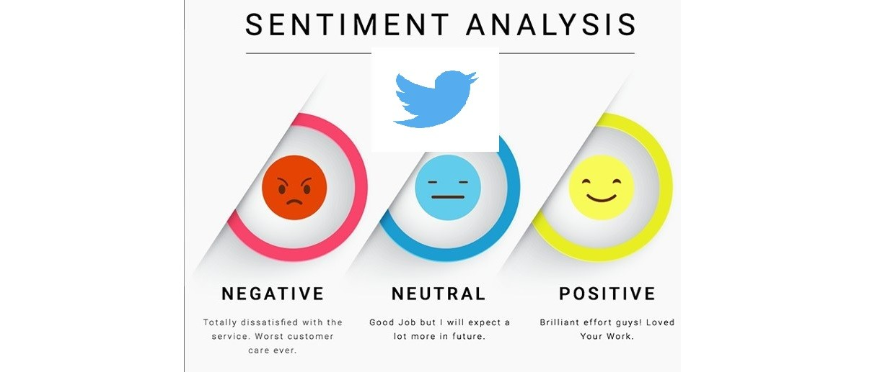

# 👹 Twitter Sentiment Analysis 

 

## Problem Statement

Gaining insights from user sentiment on platforms like Twitter and comment sections offers substantial value during product launches 🚀. By employing sentiment analysis 📊, companies can decode customer feedback and behavior, making decisions that are both data-driven and timely. This proactive approach allows them to address concerns and enhance product features, ultimately boosting revenue 💰 and improving customer satisfaction 😊.

## Machine Learning and Data Science

Our approach employs machine learning techniques and text extraction to predict the sentiment of a given text, determining whether it is positive 😊 or negative 😞. We start by analyzing the text and examining the key words within it. Once we gain a full understanding of the text, we apply deep neural networks 🧠 for sentiment analysis. The results from this analysis are then used in further machine learning processes to predict the sentiment, categorizing it as either positive or negative.

## Natural Language Processing (NLP)
We will use natural language processing (NLP) 🗣️, essential for machine learning analysis. NLP transforms the text into mathematical vectors 🔢, which are then used in various machine learning models for prediction. Once converted into these vectors, the data is fed into machine learning models to make predictions. By combining the original features from the text with newly created ones, both machine learning and deep learning models 🧠 ensure the most accurate results and predictions 🎯.

## Vectorizers 

Using vectorizers is crucial for machine learning 🔍. They convert a given text, originally in string format, into a vector representation 🔢, which machine learning models use for prediction. Below are some of the vectorizers applied during the process of transforming text into mathematical representations for analysis and prediction.

* [__Count Vectorizer__](https://scikit-learn.org/stable/modules/generated/sklearn.feature_extraction.text.CountVectorizer.html)
* [__Tfidf Vectorizer__](https://scikit-learn.org/stable/modules/generated/sklearn.feature_extraction.text.TfidfVectorizer.html)

## Models

In this project, a single machine learning model was employed to predict the sentiment of tweets. Below is the model used for the sentiment prediction task.

* [__Deep Neural Networks__](https://www.tensorflow.org/api_docs/python/tf/keras/Model)

## Exploratory Data Analysis (EDA)

After conducting exploratory data analysis 🔍, the results showed that neutral sentences outnumber both positive and negative sentiments. Using word clouds ☁️, words like good, awesome, and great appeared most frequently in positive sentiments, while for negative sentiments, words such as hate, sorry, and sad were predominant.

We have an image displaying a dataframe and a list of features. We'll use the 'text' feature as input and the 'sentiment' feature as the target variable 🎯. Our objective is to predict whether a text will be classified as positive, negative, or neutral.

The countplot below illustrates that the majority of texts are classified as neutral sentiment, while the count of negative and positive texts is comparatively lower. This indicates a higher prevalence of neutral sentiments in the dataset.

Wordcloud gives a good representation by the presence of words based on their size. In other words, more frequent words appear in higher size as compared to others. Words such as "thank" and "day" are used most often in the positive tweets. 

The wordcloud provided showcases negative tweets within the dataset. Notably, recurring words like "hate" and "sad" are prevalent, indicating their significance in identifying negative sentiment.

## Hyperparameter Tuning 

In our project, after thoroughly understanding various machine learning models, we will move on to hyperparameter tuning 🔧. This essential step is focused on selecting the optimal hyperparameters that deliver the best results for each model. By fine-tuning these parameters, we can significantly improve the accuracy and performance of our models 📈. Our goal is to explore how different hyperparameters influence model outcomes and their impact on solving different problem statements. Ultimately, we aim to implement these optimized models in a production environment 🚀, utilizing their full potential to achieve the desired results.

## Results 

The noticeable gap between the training loss and test loss indicates potential overfitting in the model 🎯. However, the model may still be useful for making predictions, as it could generalize well to unseen test data, despite its exceptionally strong performance on the training set.

